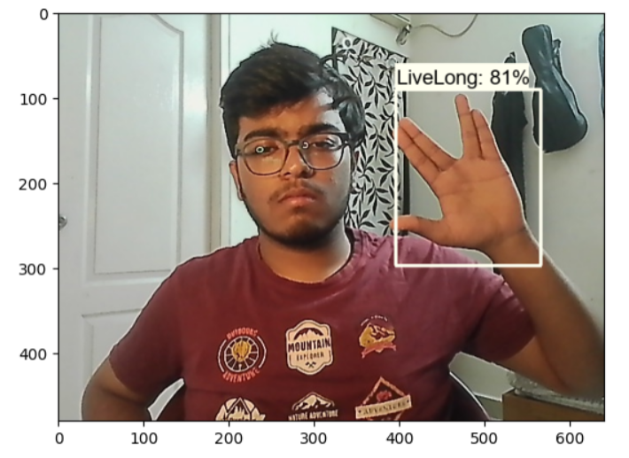

# Sign Language Detection Model

## 📌 Project Overview
This project focuses on building a **Sign Language Detection Model** that uses **Machine Learning** and **Computer Vision** to recognize and interpret hand gestures in real time. The goal is to bridge the communication gap for people with hearing impairments by converting sign language into text or speech.

Average Detection Accuracy recieved was 96%*




## 🚀 Features
- 📷 **Real-time hand gesture detection** using a webcam.
- 🤖 **Deep Learning-based classification** of sign language.
- 🔤 **Translation of signs** into readable text.
- 🎤 **Optional text-to-speech conversion** for voice output.
- 📊 **Model training and evaluation** using a labeled dataset.

## 🛠 Tech Stack
- **Python** 🐍
- **OpenCV** 🎥 (for real-time video processing)
- **TensorFlow/Keras** 🤖 (for deep learning model training)
- **Mediapipe** 🖐️ (for hand tracking and landmark detection)
- **Numpy & Pandas** 📊 (for data handling)

## 📂 Project Structure
```
📂 Sign-Language-Detection
├── 📁 dataset/              # Contains labeled images for training
├── 📁 models/               # Trained model and checkpoints
├── 📁 utils/                # Helper functions
├── 📄 train.py              # Script for training the model
├── 📄 detect.py             # Script for real-time sign detection
├── 📄 requirements.txt      # Required dependencies
├── 📄 README.md             # Project documentation
```

## 🏗️ Setup & Installation
### Clone the repository
```bash
git clone https://github.com/your-username/sign-language-detection.git
cd sign-language-detection
```

### Create a virtual environment (optional but recommended)
```bash
python -m venv venv
source venv/bin/activate  # On Windows: venv\Scripts\activate
```

### Install dependencies
```bash
pip install -r requirements.txt
```

## 🎯 How to Run
### Train the model (if not already trained)
```bash
python train.py
```

### Run the sign detection model
```bash
python detect.py
```

## 📈 Model Training
- The model is trained on a dataset containing labeled images of different sign gestures.
- Uses **CNNs (Convolutional Neural Networks)** for image classification.
- **Data augmentation** is applied to improve model accuracy.

## 📚 Future Enhancements
- 🌍 Support for **multiple sign languages** (ASL, ISL, BSL, etc.).
- 📱 Deploy as a **mobile app** using Flutter or React Native.
- 🤖 Improve accuracy with **transformer-based models**.

## 🤝 Contributing
Contributions are welcome! Feel free to **fork the repo**, **raise issues**, and **submit PRs**.
